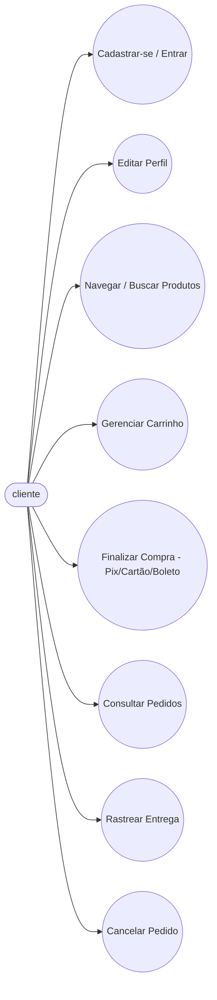
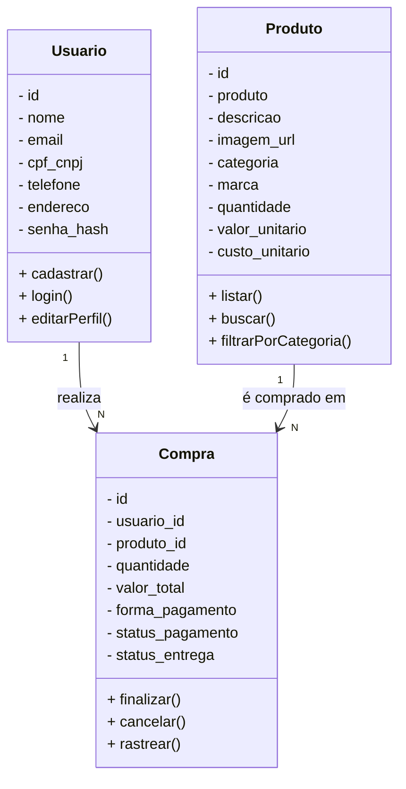
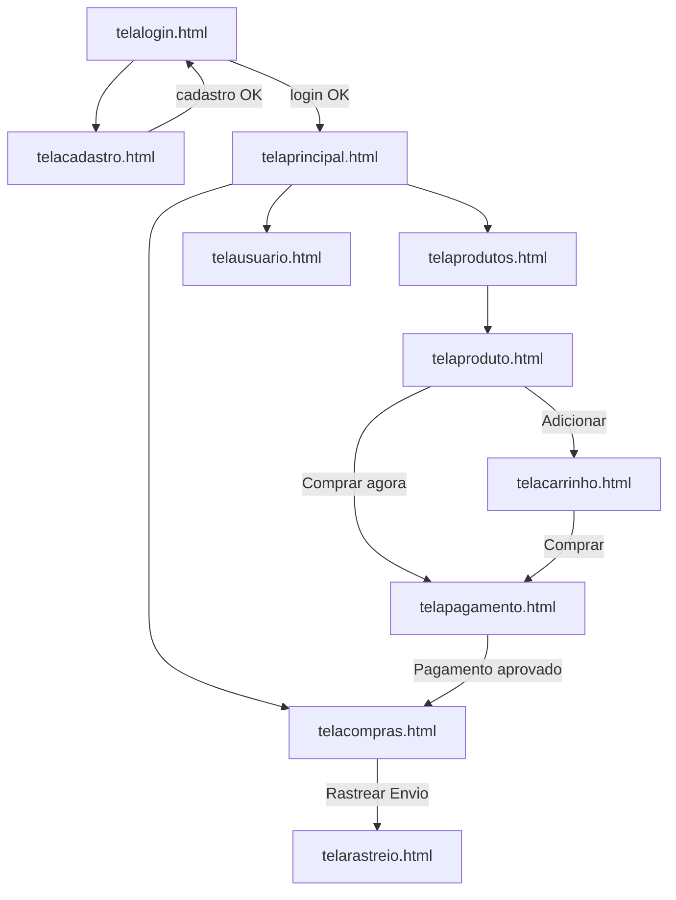
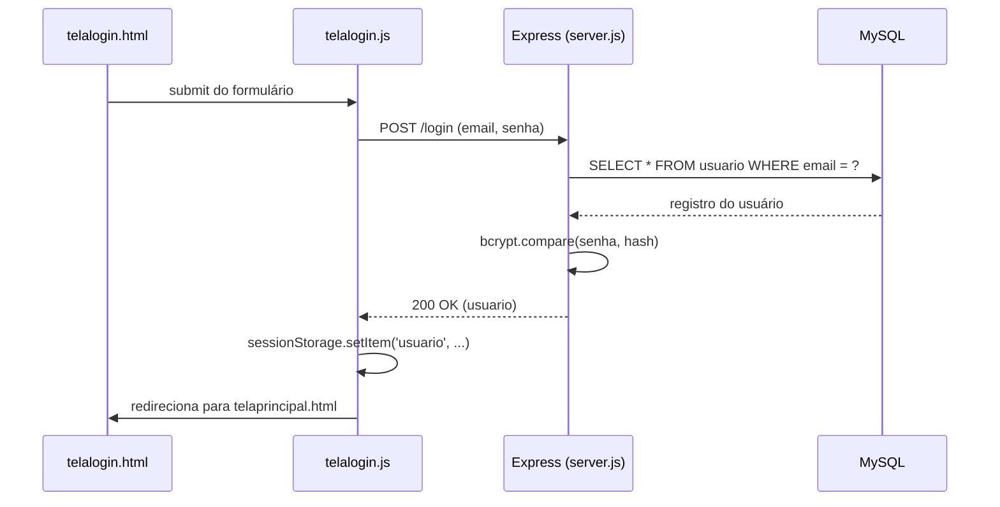
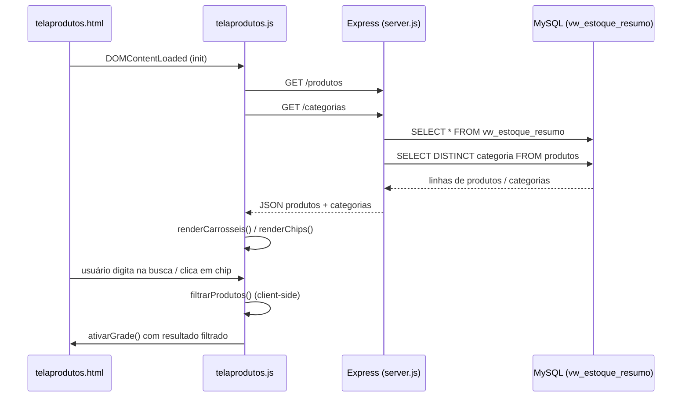
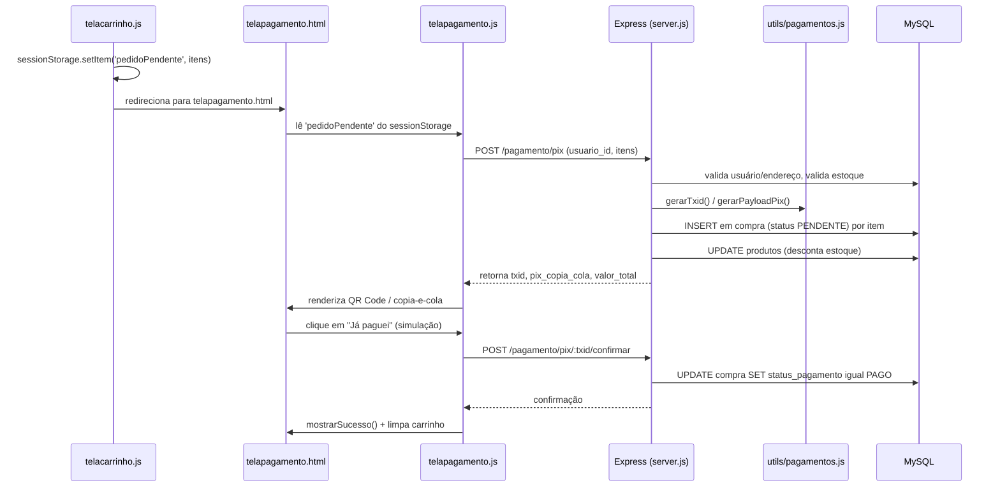
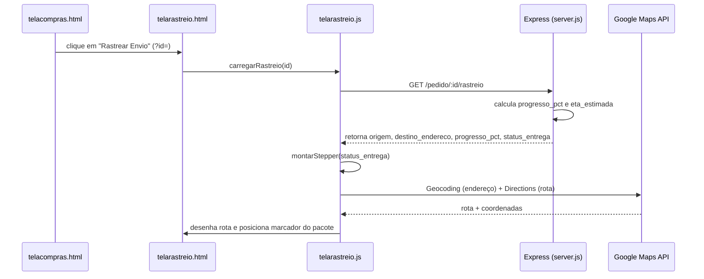

# Nexus Imports

E-commerce fictício (projeto de estudo) de hardware e periféricos de informática, com frontend em HTML/CSS/JS puro (visual dark/neon roxo-rosa) e backend em Node.js/Express + MySQL. Cobre o fluxo completo de uma loja virtual: cadastro/login, catálogo com filtros, carrinho, checkout com Pix/Cartão/Boleto, histórico de pedidos e rastreio de entrega num mapa.

# Caso de Uso



## Diagrama de Classes (conceitual)



## Fluxo de Navegação (telas do frontend)



# Rotas da API (Backend)

- **POST /cadastro** - Cria um novo usuário (hash de senha com bcrypt, valida e-mail/CPF únicos).
- **POST /login** - Autentica usuário e devolve os dados de sessão.
- **PUT /usuario/:id** - Atualiza nome, e-mail, telefone e endereço do usuário.

- **GET /produtos** - Lista produtos ativos (filtros opcionais `?categoria=` e `?busca=`).
- **GET /categorias** - Lista as categorias distintas de produtos ativos.
- **GET /produto/:id** - Detalhe de um produto específico.

- **POST /compra** - Finaliza uma compra simples (fluxo legado, sem forma de pagamento).
- **GET /compras/:usuario_id** - Histórico de pedidos de um usuário.
- **PUT /compra/:id/cancelar** - Cancela um pedido (bloqueado se já enviado/entregue).

- **POST /pagamento/pix** - Gera cobrança Pix (payload BR Code/EMV + QR).
- **POST /pagamento/pix/:txid/confirmar** - Confirma pagamento Pix (botão de simulação).
- **POST /pagamento/cartao** - Processa pagamento com cartão de crédito/débito (simulado).
- **POST /pagamento/boleto** - Gera boleto (linha digitável de demonstração).
- **POST /pagamento/boleto/:codigo/confirmar** - Confirma pagamento de boleto (simulação).

- **GET /pedido/:id/rastreio** - Retorna origem, destino, progresso estimado (%) e ETA do pedido.

- **GET /usuarios** - Lista usuários (protegida por header `x-admin-key`).
- **GET /status** - Healthcheck simples (`{ ok: true }`).

# Conceitos e Tecnologias

- **Frontend**: HTML5 + CSS3 (variáveis CSS, sem framework) + JavaScript puro (Vanilla JS, IIFE por tela).
- **Backend**: Node.js + Express 5, seguindo o padrão MVC simplificado (rotas na própria `server.js`, utilitários separados).
- **Banco de Dados**: MySQL (via `mysql2/promise`), com Views, Triggers e Stored Procedure.
- **Autenticação**: senha com hash `bcrypt`; sessão do usuário mantida no `sessionStorage` do navegador (sem JWT/cookies).
- **Pagamentos**: geração de payload Pix no padrão oficial do Bacen (EMV + CRC16), cartão com validação de bandeira/Luhn, e boleto de demonstração — todos simulados (sem gateway de pagamento real conectado).
- **Mapas**: Google Maps JavaScript API + Directions API + Geocoding API, usadas na tela de rastreio.

# Funções MySQL

- CREATE - Cria tabelas e views dentro do banco `Banco`.
- INSERT - Cria registros (usuários, produtos, compras).
- SELECT - Consulta e filtra dados (produtos por categoria/busca, pedidos por usuário).
- ALTER - Adiciona colunas às tabelas (ex.: migração de pagamento/rastreio em `compra`).
- UPDATE - Atualiza registros (perfil do usuário, estoque, status de pagamento/entrega).
- DELETE/DROP - Não usados em tempo de execução (sem exclusão de registros pela aplicação).

# Conceitos MySQL usados no projeto

- **Banco de Dados**: `Banco`, criado/recriado pelo script `Backend/sql/Banco.sql`.
- **Tabelas**: `usuario`, `produtos`, `compra`, `historico_estoque`, `estoque_referencia`.
- **Views**: `vw_estoque_resumo` (produtos ativos, usada pelas rotas de catálogo), `vw_estoque_por_categoria`, `vw_pedidos_pendentes_preparo`, `vw_historico_pedidos`.
- **Triggers**: `calcula_total` (calcula `valor_total` ao inserir em `compra`) e `trg_compra_update` (recalcula total e ajusta `pago_em`/`entregue_em`/status ao atualizar).
- **Stored Procedure**: `sp_baixa_estoque(compra_id)` — dá baixa no estoque e registra o movimento em `historico_estoque`, evitando baixa duplicada.

# Bibliotecas / Dependências (Node.js)

Este é um projeto full-stack, utilizando as tecnologias:

- **express** — servidor HTTP e roteamento das APIs, além de servir o frontend estático.
- **mysql2** — driver MySQL com suporte a `async/await` (`mysql2/promise`).
- **bcrypt** — hash de senhas de usuário.
- **dotenv** — carregamento de variáveis de ambiente (`.env`) como senha do banco e chaves de pagamento.

## Dependências de desenvolvimento

- **VSCode**: IDE (Interface de Desenvolvimento).
- **Mermaid**: linguagem para confecção de diagramas em documentos `.md`.
- **MySQL**: SGBD (sistema gerenciador de banco de dados), usado para persistir usuários, produtos e pedidos.
- **Google Maps Platform**: usada na tela de rastreio (chave configurável em `frontend/js/nexus-config.js`).

## Build / Como rodar localmente

**Diretório raiz do backend:**
```
cd nexus_site/Backend
```

**Instalar dependências:**
```
npm install
```

**Configurar variáveis de ambiente:** crie um arquivo `Backend/.env` com, no mínimo:
```
DB_PASS=sua_senha_mysql
ADMIN_KEY=uma_chave_qualquer
PIX_KEY=pagamentos@nexusimports.com.br
PIX_MERCHANT_NAME=NEXUS IMPORTS
PIX_MERCHANT_CITY=CONTAGEM
```

**Criar o banco de dados:**
```
mysql -u root -p < sql/Banco.sql
mysql -u root -p Banco < sql/migracao_pagamento_rastreio.sql
```

**Subir o servidor:**
```
npm start
```

**O backend também serve o frontend automaticamente em:** `http://localhost:3000`
(o `express.static` aponta para a pasta `frontend/`, então basta abrir `telalogin.html` a partir dali).

## Diagrama de Sequência — **Login**


## Diagrama de Sequência — **Listagem e Filtro de Produtos**


## Diagrama de Sequência — **Checkout via Pix**


## Diagrama de Sequência — **Rastreio de Entrega**
